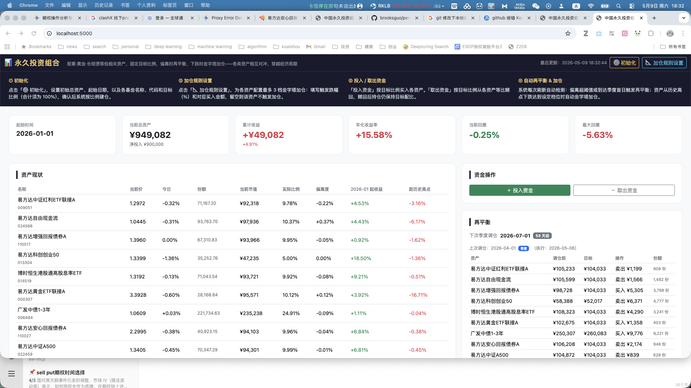

# permanent-portfolio
 (screenshot2.png)
该项目提供一个网页，监控你的永久投资组合，指导你按照固定比例进行再平衡，提醒你在特定时间进行加仓； 

📊 永久投资组合 股票·黄金·长短债等低相关资产，固定目标比例，偏离时再平衡，下跌时金字塔加仓——各类资产相互对冲，穿越经济周期

① 初始化
点击「⚙️ 初始化」，设置初始总资产、起始日期，以及各基金名称、代码和目标比例（合计须为 100%），确认后系统按比例建仓。

② 加仓规则设置
点击「📐 加仓规则设置」，为各资产配置最多 3 档金字塔加仓：填写触发跌幅（%）和对应买入金额，留空则该资产不触发加仓。

③ 投入 / 取出资金
「投入资金」按目标比例买入各资产。「取出资金」按目标比例从各资产等比赎回，赎回后持仓仍保持目标配比。

④ 自动再平衡 & 加仓
系统每次刷新自动检测：偏离超阈值或到达季度首日触发再平衡；资产从历史高点下跌达到设定档位时自动金字塔加仓。

ps. 
1.目前系统支持从天天基金抓取任意基金信息；股票也支持， 但尚未测试；  
2.收益率采用类似富途的简单加权方式计算， 现金分红也计算入收益率； 
3. 目前默认拉取的数据是2026年截止到今天； 
